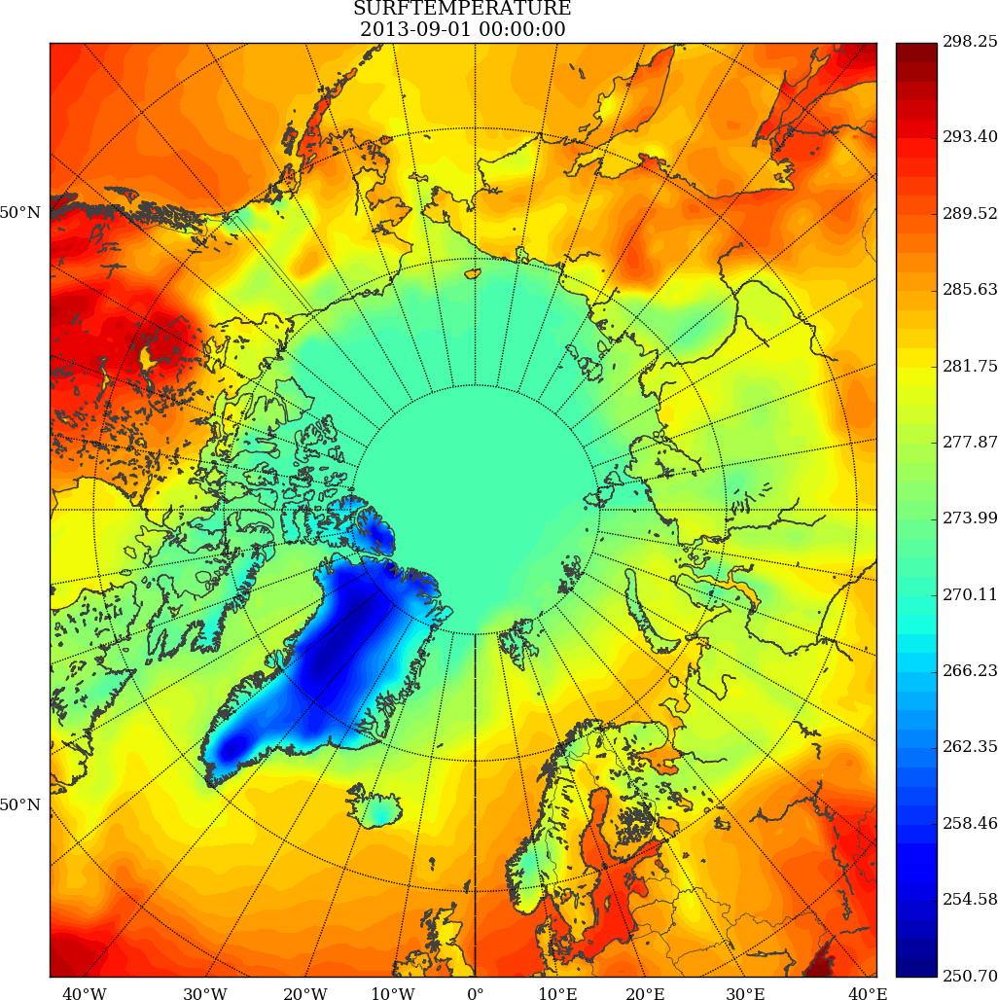

class: center, middle, inverse

# Simple example presentation

David Lindstedt, SMHI

<!--
[comment]: # this doesn't work good footer stretches out of slide.

layout: true

<div id="footer-content">
    
    David Lindstedt
</div>
-->

---

## Another slide

Try **F** and **P** keys.

- A bullet point
- Another convincing argument

---

## Slide with two columns

.left-column[
## Left heading

- Some
- Bullet
- Points
]

.right-column[
## Right heading

- Other
- Interesting
- Bullet points
]

---

## Code blocks are no problem

Here we have some Python code:

```python
from itertools import cycle

fizz = cycle(['', '', 'Fizz'])
buzz = cycle(['', '', '', '', 'Buzz'])

for i in range(1, 101):
    print((next(fizz) + next(buzz)) or i)
```

[Source](https://github.com/olemb/nonsense/blob/master/fizzbuzz/itertools_cycle.py)

---

## Images

An image fetched from the web:


---

## Local image


.cite[Lindstedt et. al., Tellus (2015)]

---

background-image: url(img/neverforget.jpg)
class: background

# Background image


---

## Videos
<video width="400" controls>
  <source src="img/mov_bbb.mp4" type="video/mp4">
  Your browser does not support HTML5 video.
</video>

---

## Math equations
`\(E = mc^2\)`
`$$ \Gamma(t) = \pi \, \Im\left\{ \mathbf{x}_+^H(t) \, \frac{\mathrm{d}}{\mathrm{d} t}\mathbf{x}_+(t) \right\} $$`

---

## Unravel text

- figure 1

---

count: false
## Unravel text

- figure 1
- figure 2

---

count: false
## Unravel text

- figure 1
- figure 2
- figure 3

---

## Unravel text (better way, not solved)
use countIncrementalSlides see

https://github.com/gnab/remark/wiki/Markdown#count

- figure 1

--
- figure 2

--
- figure 3

---

## Slide notes

- Press P, to get presentation mode and see if you have any notes..

???
This is my notes and only visible to me..
